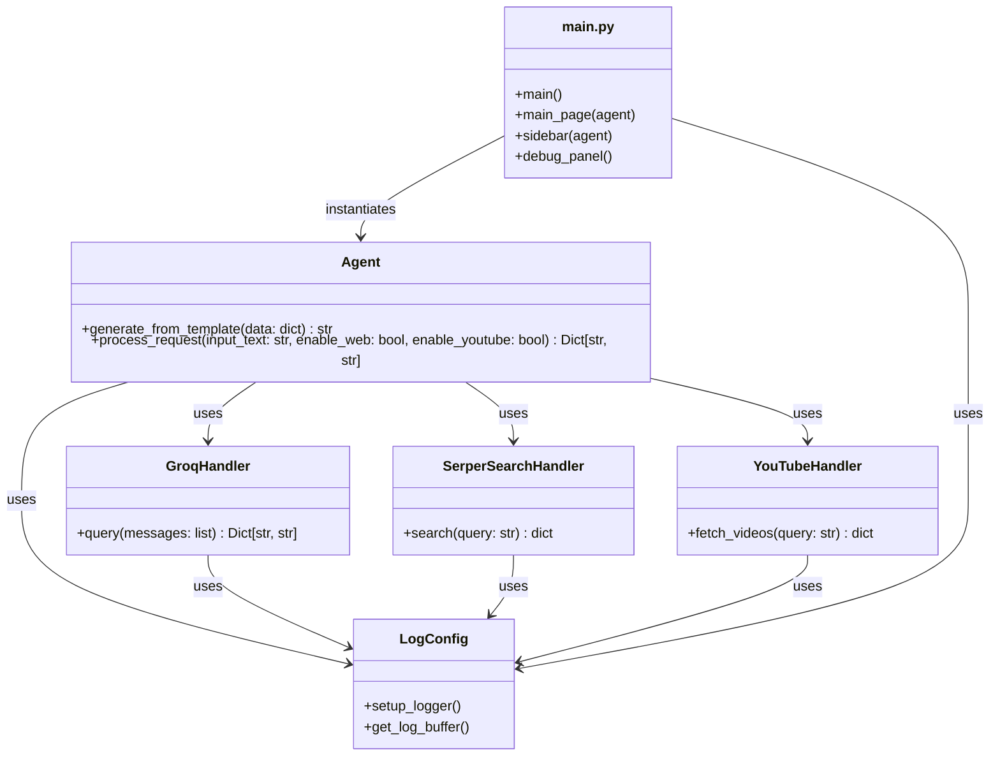

# Ask the Web + YouTube

## Overview

Ask the Web + YouTube is an agentic search application that leverages LLMs to answer queries using web and YouTube data sources.

## Features

- Modular agent architecture
- Integrates with Groq LLM, Serper (web search), and YouTube APIs
- Logging and test coverage

## Project Structure

```text
ask_web_youtube/                  # Project root directory
├── agent/                        # Core agent logic and related modules
│   ├── agent.py                  # Main agent class and logic
│   ├── __init__.py               # Marks agent as a Python package
│   ├── services/                 # Service integrations for the agent
│   │   ├── __init__.py           # Marks services as a Python package
│   │   ├── llm_handler/          # Handlers for LLM (Groq) integration
│   │   │   ├── groq_handler.py   # Handles communication with Groq LLM
│   │   │   └── __init__.py       # Marks llm_handler as a Python package
│   │   ├── serper_search_handler.py # Handles web search via Serper API
│   │   └── youtube_handler.py    # Handles YouTube API integration
│   └── templates/                # Jinja2 templates for agent prompts
│       └── agent_input_template.jinja2 # Template for LLM Prompt
├── Dockerfile                    # Docker configuration for containerization
├── __init__.py                   # Marks root as a Python package
├── main.py                       # Application entry point and UI logic
├── Makefile                      # Build, run, and test automation commands
├── requirements.txt              # Python dependencies
├── tests/                        # Unit and integration tests
│   ├── __init__.py               # Marks tests as a Python package
│   ├── test_groq_handler.py      # Tests for Groq handler
│   ├── test_serper_search_handler.py # Tests for Serper search handler
│   └── test_youtube_handler.py   # Tests for YouTube handler
└── utils/                        # Utility modules
    ├── __init__.py               # Marks utils as a Python package
    └── log_config.py             # Logging configuration and helpers
```

## UML Diagram



## Getting Started

1. **Build the application:**

   ```sh
   make build
   ```

2. **Run the application:**

   ```sh
   make run
   ```

## Testing

Run all tests with:

```sh
make tests
```

## Demo

<div style="position: relative; padding-bottom: 56.25%; height: 0;"><iframe src="https://www.loom.com/embed/5fc635bf677540ab9cb675148a11945f?sid=12c297cc-ad29-4aa7-a6b5-19471643adaa" frameborder="0" webkitallowfullscreen mozallowfullscreen allowfullscreen style="position: absolute; top: 0; left: 0; width: 100%; height: 100%;"></iframe></div>
